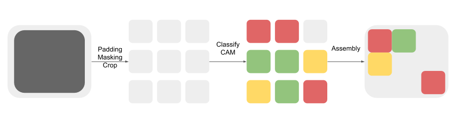

## Analysis Component

This is the analysis component for PM/BlackBird robots. We basically do the transition from MATLAB-based implementation to Python-based one.


### Workflow

The process is finished on-the-fly, which means there is no any intermediate result saved during execution.

```console
1. Padding and Masking (Buffering)
2. Crop (from a full-size leaf disc to multiple leaf patches)
3. Classification and activation mapping building
4. Assembly
5. Save
```



### Files

The **PM_analyzer.py** is the key script for this component. It is the integration of the above mentioned steps while the **test_analyzer.py** is a simple version of it. The input and output for the **PM_analyzer.py** is the full-size leaf disc, whereas the input and output for the **test_anlayzer.py** is the leaf patches.

```console
- PM_analyzer.py: The main script
- leaf_mask.py: The script genrating masks for the full-size leaf disc
- test_analyzer.py: The script used to test the analyzer
```

We utilize the visualization module in this component:

```Python
import sys
sys.path.insert(1, '../visualization')

from gradcam import GradCam
from guided_backprop import GuidedBackprop      # AlexNet SqueezeNet
from guided_backprop_resnet import GuidedBackprop as GuidedBackpropResNet
from guided_gradcam import guided_grad_cam

if model_type == 'SqueezeNet':
    # Grad-CAM
    grad_cam = GradCam(model=model, feature_module=model.features,
                    target_layer_names=['12'], cuda_id=None)
    # Guided-backpropogation
    guided_bp = GuidedBackprop(model, cuda_id=None)
elif model_type == 'ResNet':
    grad_cam = GradCam(model=model, feature_module=model.layer4,
                   target_layer_names=['2'], cuda_id=None)
    guided_bp = GuidedBackpropResNet(model)
```
